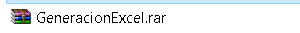
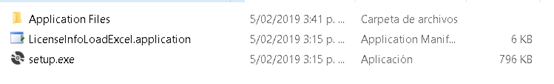
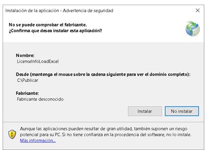
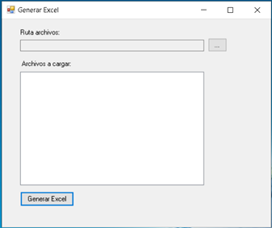
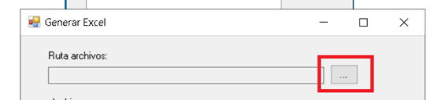

# statistics2excel
A continuación se describe paso a paso la instalación y ejecución del aplicativo que genera el Excel para la muestra de las estadísticas de uso de licencias por usuario y máquina.

### Características
* Permite crear archivo en formato *.xls consignando datos recolectados

---
### Requisitos
* Contar con los archivos de las estadisticas generados por la utilidad `count_licenses.bat `
---

### Instalación

Descomprima el .zip o .rar `GeneraciónExcel.rar`

Dentro de la carpeta, encontrará los siguientes archivos:

Haga clic en el archivo .exe y se desplegará la siguiente ventana.

Hacer clic en instalar. Una vez finalizado el proceso se desplegará la aplicación:

### Uso
Para la generación del Excel, ejecute los siguientes pasos en orden:

- Cargue los archivos .txt que tienen la información del uso de licencias. Para ello haga clic en el botón de navegación de archivos

- Navegue hasta la carpeta que contiene el grupo de archivos .txt sobre los que desea generar el Excel. Tenga en cuenta que en esta carpeta solo deben encontrarse archivos .txt que hayan sido generados con la herramienta que lleva a cabo el monitoreo y genera los mismos. Esto debido a que el aplicativo espera una estructura definida para su funcionamiento.

- Una vez localizada la carpeta, de clic sobre ella y de Acpetar. En el aplicativo se muestra el listado de archivos a leer.

- Por último, haga clic en el botón “Generar Excel”. Esto inicia el proceso, el cuál se va describiendo dentro de la misma ventana. Al concluir se muestra un mensaje al final que dice “Excel Generado Exitosamente” e igualmente se despliega el  mismo mensaje en una ventana de información.

- El aplicativo fue configurado para que el Excel se genere en la misma carpeta donde se encuentran los .txt que se utilizaron para generar el mismo. El archivo queda con el nombre ConteoLicencias_ y se le adiciona la fecha con hora, minutos y segundos.

- Al abrir el archivo de Excel, encontrará que este dispone de tres hojas de cálculo, Total_Cont_Licencias más la fecha del archivo .txt más reciente, Distr_Usuarios y Distr_Maquinas. 

- En la primera hoja de cálculo Total_Cont_Licencias, encontrará toda la información correspondiente a las distintas licencias. Fecha, Hora, Tipo de Licencia etc. Los datos más importantes, corresponden a la Fecha, el Feature, es decir, el tipo de licencia, la cantidad total de la misma, las licencias disponibles, en uso y porcentaje de uso de estas. Con sus respectivos filtros para facilitar la organización de la información a la hora de generar los gráficos.

- En la segunda y tercera hoja de cálculo, encontrará el listado de usuarios y máquinas. Esto incluye, el nombre del usuario y máquina, el tipo de licencia y el conteo total por licencia de ese usuario o máquina. Esto es el total de cuantas veces apareció ese usuario o máquina por licencia en la totalidad de los .txt cargados.

